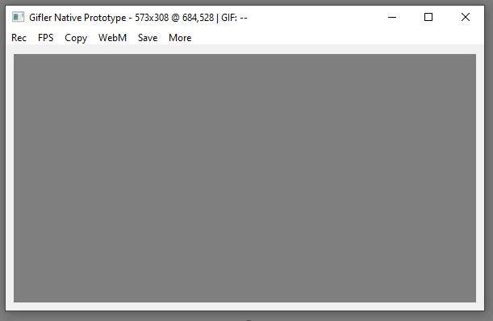

# Gifler

[](https://github.com/lmccandless/gifler/actions/workflows/windows-build.yml)
[](LICENSE)
[](https://github.com/lmccandless/gifler/releases)

Gifler is a compact native Windows screen recorder built around a transparent, click-through viewfinder. Position the window over anything on your desktop, record it, preview it, and export or copy the result as GIF, MP4, animated WebP, or WebM.



## Download

Download the current Windows executable from [GitHub Releases](https://github.com/lmccandless/gifler/releases/latest), or use the direct [Gifler.exe download](https://github.com/lmccandless/gifler/releases/latest/download/Gifler.exe).

Gifler is an unsigned early-preview executable. Windows SmartScreen may ask for confirmation until releases are code-signed.

## Highlights

- Native Win32/C++20 application with no .NET, Electron, Qt, or installer.
- Transparent click-through recording region that remains visible while idle and recording.
- Movable capture window whose recording region follows the window dynamically.
- 5, 10, 15, and 30 FPS capture with optional cursor recording.
- GIF, H.264 MP4, animated WebP, and VP9 WebM export.
- Copy the selected media type to the Windows clipboard as a file drop.
- Responsive background export with visible progress.
- Preview playback and a basic frame editor.
- Remembers the last FPS, media format, and cursor preference.

## Quick Start

1. Download `Gifler.exe` from the latest release.
2. Put `ffmpeg.exe` on `PATH`, or place it at `encoders\ffmpeg.exe` beside Gifler.
3. Run Gifler, position and resize the viewfinder, then select **Rec**.
4. Stop recording, select an output format, and use **Save** or **Copy**.

Recording and preview are contained in the small Gifler executable. Media encoding is delegated to FFmpeg so the application can remain small. Gifler also discovers optional `gifski.exe` and `gifsicle.exe` tools in the same `encoders` directory or on `PATH`. See [encoder setup](docs/encoder-setup.md).

## Building

Requirements:

- Windows 10 or 11 x64
- Visual Studio 2022 with the Desktop development with C++ workload
- Windows 10/11 SDK
- CMake 3.24 or newer

Run the canonical scripts from PowerShell:

```powershell
./scripts/build-debug.ps1
./scripts/run-tests.ps1
./scripts/build-release.ps1
```

Release output is written under `build/<preset>/Release/Gifler.exe`. The packaging script also places a standalone executable at `dist/Gifler.exe`.

## Project Layout

```text
src/gifler_app/           Main Win32 application and UI
src/gifler_capture_dxgi/  Desktop capture providers
src/gifler_core/          Frames, geometry, diffing, and settings
src/gifler_editor/        Frame editor
src/gifler_export/        GIF and video export pipeline
src/gifler_record/        Recording session and frame storage
src/gifler_win32/         Focused Win32 helpers
spikes/                   Native behavior and integration probes
tests/                    Dependency-free unit tests
docs/                     Architecture, decisions, and manual checks
```

## License and Authorship

Copyright (C) 2026 lmccandless.

Gifler is licensed under the [GNU Affero General Public License v3.0 only](LICENSE). This is a strong copyleft open-source license: covered modifications and redistributed versions must preserve the license and corresponding-source obligations. Copyright and authorship notices may not be removed.

Open source necessarily permits use, modification, and redistribution under the license terms. It does not transfer ownership of the original copyright or grant rights to misrepresent a modified build as the original project. See [NOTICE](NOTICE) for attribution and project-name terms.

## Security

Please report security issues according to [SECURITY.md](SECURITY.md) rather than posting sensitive details in a public issue.
